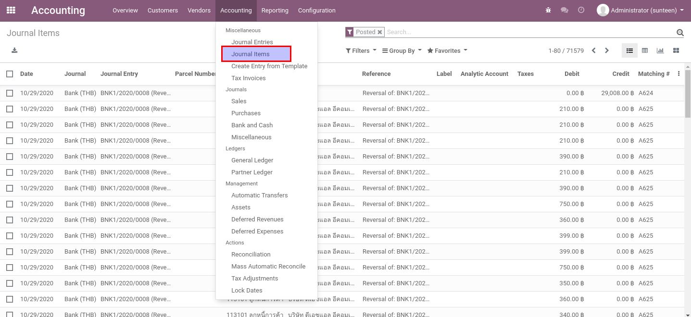
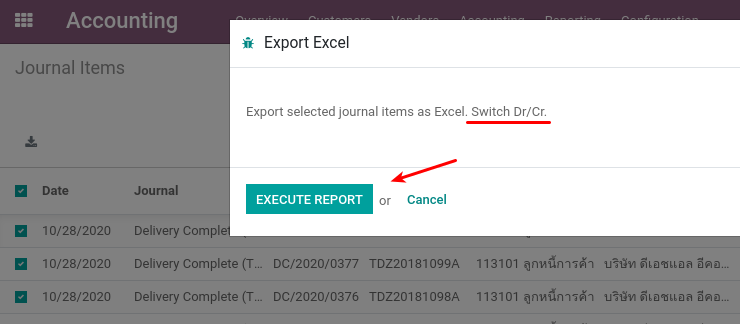
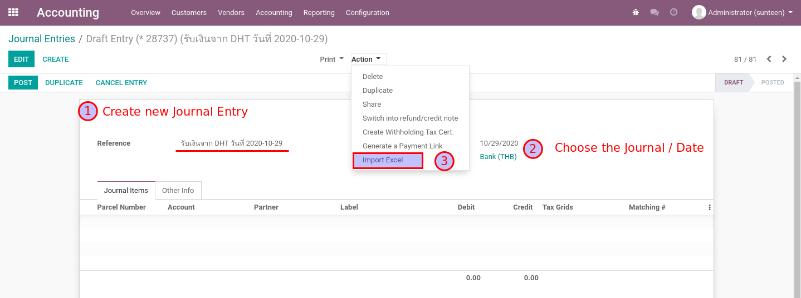
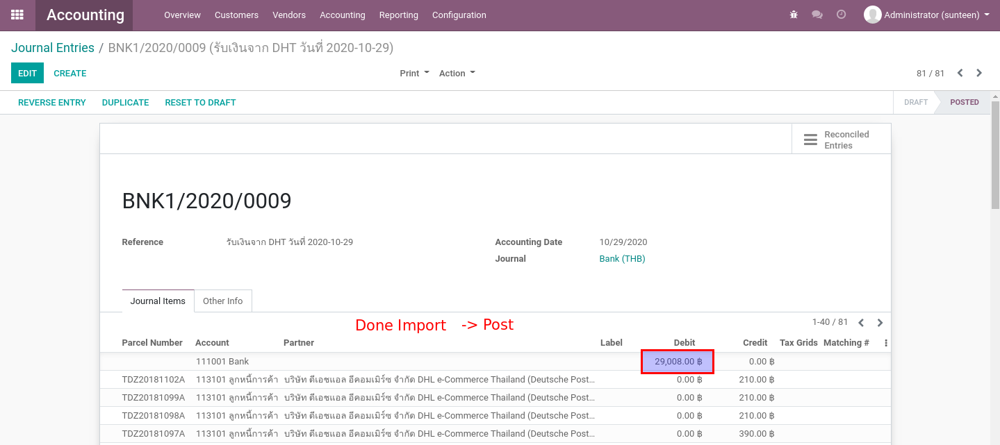
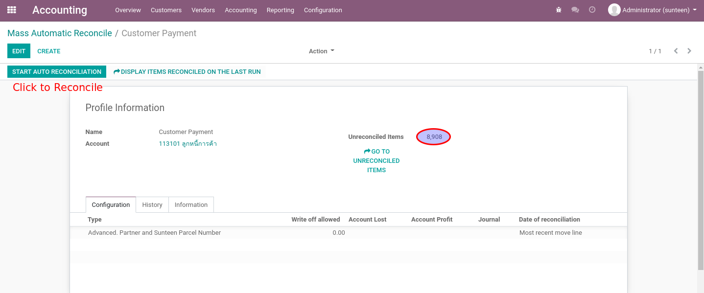

945 Functional Manual
=====================

Overview
--------

เอกสารชุดนี้จะกล่าวถึงส่วนต่างๆ 3 ส่วนที่ประกอบกันขึ้นมาเป็นระบบของ 945

1. ส่วน Automatic Workflow :: ส่วนนี้เป็นการบันทึก Operations ต่างๆที่เกิดขึ้นจากระบบหน้าบ้านทั้งหมด เช่นการขาย ค่าขนส่ง การส่งของ โดยทั้งหมดจะยิงผ่าน API
   เข้ามาทาง หน้าต่างของ Odoo ที่เกี่ยวข้องกับแต่ละ operation สุดท้ายแล้วทั้งหมดจะทำให้เกิดการบันทึกบัญชีต่างๆก่อนจะไปขบที่การตั้งหนี้เพื่อรอการ Manual เคลียร์โดยนักบัญชี
   ในส่วนแรกจะเกิดขึ้นโดยอัตโนมัติทั้งหมดโดยที่ผู้ใช้งานอาจไม่ได้ต้องทำอะไร แต่เอกสารชุดนี้จะแนะนำเป็นสังเขป ให้เห็นว่าเบื้องหลังเกิดขึ้นที่จุดใดในระบบ
2. ส่วน Manual Operations :: เป็นการทำงานโดยนักบัญชีผ่านหน้าจอเพื่อทำงานต่างๆของ Odoo เช่น การจ่ายหนี้ การจ่าย Commission การรับเงินเข้าธนาคาร
3. ส่วน Reporting :: ข้อมูลด้านบัญชีทั้งหมดที่เกิดขั้นในข้องี่ 1 และ 2 จะถูกนำมาวิเคราะห์ผ่านระบบรายงานของ Odoo หรือผ่านระบบ BI หลังบ้านอื่นๆ

Automatic Workflow
==================

Manual Operations
=================

Clear Account Receivable
------------------------

เมื่อได้รับ Statement จากธนาคารว่าได้รับเงินเข้ามาจากลูกหนี้ของทาง 945 และต้องการเคลียร์ลูกหนี้ที่ค้าง

1. ตั้งค่า Mass Automatic Reconcile สำหรับการเคลียร์ลูกหนี้
2. นำเข้า Statement ตามที่ได้รับแจ้งจากธนาคาร
3. ทำการ Reconcile และตรวจสอบผลลัพธ์

1. การตั้งค่า Mass Automatic Reconcile
#############################################

Accounting > Accounting > Actions > Mass Automatic Reconcile

2. นำเข้า Statement ตามที่ได้รับแจ้งจากธนาคาร
############################################

1. เตรียม Excel โดยใช้ข้อมูลจาก statement ที่ได้รับมา
2. ที่เมนู Journal Entries สร้างรายการใหม่ ซึ่งจะทำหน้าที่เป็น Payment Entry
3. คลิกเมนู Action / Import Excel
4. ตรวจทานให้เรียบร้อยจึงก่อน Post

.. nextslide::

.. note::
    ขั้นตอนนี้เป็นทางเลือกโดยจะเป็นการ Export รายการลูกหนี้ มากลับ Dr/Cr เพื่อตั้งต้น

.. nextslide::

ค้นหารายการที่ยังไม่ได้ล้าง โดยการใช้ Advance Search ตามการทำงานปกติ

.. nextslide::

เลือกรายการที่สนใจ เพื่อนำข้อมูลออกมาที่ Excel

.. image:: images/3_export_excel.png
    :align: center

.. nextslide::

.. nextslide::

.. nextslide::

เพิ่มรายการในขา Bank เพื่อให้ Journal Entry นี้ดุล

.. note::
    ระบบจะใช้ sheet = Journal Items ในการอัพเดทข้อมูล

.. nextslide::

สร้าง Journal Entry ใหม่ ทำหน้าที่เป็นเสมือนกับ Payment Entry

.. nextslide::

เพิ่มรายการด้วยการ Import Excel ตามที่ได้เตรียมไว้

.. nextslide::

**ตรวจสอบให้แน่ใจ แล้วจึงค่อย Post**

3. ทำการ Reconcile และตรวจสอบผลลัพธ์
############################################

1. ที่เมนู Mass Automatic Reconcile เลือก Profile = Customer Payment
2. กดปุ่ม Start Auto Reconciliation ระบบจะทำการ Reconcile รายการที่มี Partner และ Parcel ID เดียวกัน
3. กดปุ่ม Display Items Reconciled On The Last Run เพื่อดูรายการที่ถูก Reconciled ไป
4. หากต้องการยกเลิกสิ่งที่ทำไปให้ทำการ Reverse Entry

.. nextslide::

ไปที่เมนู Mass Automatic Reconcile แล้วเลือก/สร้าง Profile = Customer Payment
แล้วจีง Start Reconcile

.. nextslide::

ระบบจะมีการเก็บประวัติของการ Reconcile เอาไว้ สามารถคลิกเพื่อตรวจสอบได้

.. nextslide::

รีวิวรายการที่เกิดขึ้น ให้สังเกตุที่ Reconcile ID ที่ระบบได้สร้างขึ้นเพื่อ Match Dr/Cr ล้างกัน

.. nextslide::

หากต้องการยกเลิกสิ่งที่ได้ทำไป ให้ทำการ Reverse Entry ระบบจะสร้างอีก Journal Entry เพื่อล้างตัวเอง

