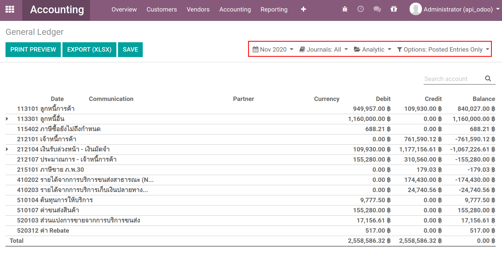
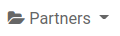

> Financial Report
=====================
รายงานทางการเงินใน Odoo V.13 (Enterprise)

รายงานทางการเงิน
-----------------

    รายงานทางการเงิน หรือ การสื่อข้อมูลทางการเงินเพื่อให้บุคคลภายใน และบุคคลภายนอกได้นําไปใช้ในการตัดสินใจเชิงเศรษฐกิจ
    โดยมีงบการเงินเป็นส่วนประกอบที่สําคัญของการรายงานทางการเงิน ทั้งนี้อาจจะทําในรูปแบบของรายงานภายในกิจการ รายงานประจําปี

รายงานที่สามารถแสดงได้จากระบบมีดังนี้

.. image:: images/accounting_report/all_report.png
   :align: center

1. Trial Balance : งบทดรอง
2. General Ledger : สมุดบัญชีแยกประเภททั่วไป
3. Profit and Loss : งบกำไรขาดทุน
4. Balance Sheet : งบดุล
5. Executive Summary : รายงานสัดส่วนทางการเงิน
6. Cash Flow Statement : งบกระแสเงินสด
7. Partner Ledger : รายละเอียดลูกหนี้/เจ้าหนี้
8. Aged Receivable : วิเคราะห์อายุลูกหนี้
9. Aged Payable : วิเคราะห์อายุเจ้าหนี้

1. Trial Balance  งบทดลอง
##############################

    งบทดลอง เป็นงบที่จัดทำขึ้นด้วยการนำยอดดุลในบัญชีแยกประเภทต่าง ๆ ไม่ว่าจะอยู่ด้านเดบิต หรือเครดิตก็ตาม มาคำนวณหายอดคงเหลือทั้งสองด้าน
    เพื่อพิสูจน์ความถูกต้องในการบันทึกบัญชีตามระบบบัญชีคู่ ในวันใดวันหนึ่ง เช่น ทุกสิ้นเดือน ทุก 3 เดือน หรือเมื่อสิ้นงวดบัญชี

เมื่อเข้ามาที่ Trial Balance ระบบจะแสดงข้อมูลเริ่มต้น ดังนี้

.. image:: images/accounting_report/tb.png
   :align: center

.. |date| image:: images/accounting_report/date.png

1. |date| โดยระบบจะแสดง **ค่าเริ่มต้นเป็นเดือนปัจจุบัน** แต่สามารถเลือกได้ว่าต้องการดูงบทดลองของช่วงเวลาใด

    * This Month : เดือนปัจจุบัน
    * This Quarter : ไตรมาสปัจจุบัน
    * This Financial Year : ปีปัจจุบัน
    * Last Month : เดือนก่อนหน้า
    * Last Quarter : ไตรมาสก่อนหน้า
    * Last Financial Year : ปีก่อนหน้า
    * Custom : สามารถเลือกวันเริ่มต้น (Start Date) และ วันสิ้นสุด (End Date)

.. |comp| image:: images/accounting_report/compare.png

2. |comp| สามารถดูแบบเปรียบเทียบกันได้โดย โดยปกติของระบบจะยังไม่มีการเปรียบเทียบ

    * No Comparison : ไม่มีการเปรียบเทียบ
    * Previous Period : เดือนก่อนหน้า
    * Same Period Last Year : ปีก่อนหน้า
    * Custom : สามารถเลือกวันที่เริ่มต้น (Start Date) และ วันสิ้นสุด (End Date) เพื่อมาเปรียบเทียบได้

.. |jour| image:: images/accounting_report/journal.png

3. |jour| สามารถกำหนดได้ว่า จะแสดงเอกสาร (Journal) ใดบ้าง โดยค่าเริ่มต้นจะแสดงเอกสารทั้งหมด

.. |opt| image:: images/accounting_report/option.png

4. |opt| สามารถเลือกได้ว่าต้องการให้ระบบแสดงเอกสารที่อยู่ในสถานะใดบ้าง
โดยระบบจะเลือกเอกสาร Stage : Posted Entries Only เป็นค่าเริ่มต้น

    * Include Unposted Entries : แสดงเอกสารรวมเอกสารที่ยังไม่ถูก Posted
    * Hierarchy and Subtotals : แสดงหน้าวิวเป็นรูปแบบ Hierarchy
    * Unfold All : แสดงทั้งหมด

2. General Ledger สมุดบัญชีแยกประเภททั่วไป
#########################################

    สมุดบัญชีแยกประเภททั่วไป เป็นสมุดที่รวบรวมหรือคุมยอดของบัญชีแยกประเภททุกบัญชี ซึ่งใช้บันทึกการเปลี่ยนแปลงสินทรัพย์ หนี้สินและส่วนของเจ้าของ (ทุน)
    ต่อจากการบันทึกลงในสมุดรายวันทั่วไป

เมื่อเข้ามาที่ General Ledger ระบบจะแสดงข้อมูลเริ่มต้น ดังนี้

.. image:: images/accounting_report/general_ledger.gif
   :align: center

1. |date| โดยระบบจะแสดง **ค่าเริ่มต้นเป็นเดือนปัจจุบัน** แต่สามารถเลือกได้ว่าต้องการดูงบทดลองของช่วงเวลาใด

    * This Month : เดือนปัจจุบัน
    * This Quarter : ไตรมาสปัจจุบัน
    * This Financial Year : ปีปัจจุบัน
    * Last Month : เดือนก่อนหน้า
    * Last Quarter : ไตรมาสก่อนหน้า
    * Last Financial Year : ปีก่อนหน้า
    * Custom : สามารถเลือกวันเริ่มต้น (Start Date) และ วันสิ้นสุด (End Date)

2. |jour| สามารถกำหนดได้ว่า จะแสดงเอกสาร(Journal)ใดบ้าง โดยค่าเริ่มต้นจะแสดงเอกสารทั้งหมด

3. |opt| สามารถเลือกได้ว่าต้องการให้ระบบแสดงเอกสารที่อยู่ในสถานะใดบ้าง
โดยระบบจะเลือกเอกสาร Stage : Posted Entries Only เป็นค่าเริ่มต้น

    * Include Unposted Entries : แสดงเอกสารรวมเอกสารที่ยังไม่ถูก Posted
    * Unfold All : แสดงทั้งหมด

3. Profit and Loss งบกำไรขาดทุน
################################

    งบกําไรขาดทุน เป็นรายงานทางการเงินที่แสดงผลการดําเนินงานของกิจการ ในงวดบัญชีหนึ่ง ๆ โดยการนํารายได้และค่าใช้จ่ายที่เกิดขึ้นในงวดบัญชีนั้น ๆ
    มาเปรียบเทียบกัน ผลต่างที่เกิดขึ้นจะเป็นกําไรหรือขาดทุนสุทธิ

    เมื่อเข้ามาที่ Profit and Loss ระบบจะแสดงข้อมูลเริ่มต้น ดังนี้

.. image:: images/accounting_report/profit_loss.gif
   :align: center

1. |date| โดยระบบจะแสดง **ค่าเริ่มต้นเป็นปีปัจจุบัน** แต่สามารถเลือกได้ว่าต้องการดูงบทดลองของช่วงเวลาใด

    * This Month : เดือนปัจจุบัน
    * This Quarter : ไตรมาสปัจจุบัน
    * This Financial Year : ปีปัจจุบัน
    * Last Month : เดือนก่อนหน้า
    * Last Quarter : ไตรมาสก่อนหน้า
    * Last Financial Year : ปีก่อนหน้า
    * Custom : สามารถเลือกวันเริ่มต้น (Start Date) และ วันสิ้นสุด (End Date)

2. |comp| สามารถดูแบบเปรียบเทียบกันได้โดย โดยปกติของระบบจะยังไม่มีการเปรียบเทียบ

    * No Comparison : ไม่มีการเปรียบเทียบ
    * Previous Period : เดือนก่อนหน้า
    * Same Period Last Year : ปีก่อนหน้า
    * Custom : สามารถเลือกวันที่เริ่มต้น (Start Date) และ วันสิ้นสุด (End Date) เพื่อมาเปรียบเทียบได้

3. |jour| สามารถกำหนดได้ว่า จะแสดงเอกสาร(Journal)ใดบ้าง โดยค่าเริ่มต้นจะแสดงเอกสารทั้งหมด

4. |opt| สามารถเลือกได้ว่าต้องการให้ระบบแสดงเอกสารที่อยู่ในสถานะใดบ้าง
โดยระบบจะเลือก เอกสาร Stage : Posted Entries Only เป็นค่าเริ่มต้น

    * Include Unposted Entries : แสดงเอกสารรวมเอกสารที่ยังไม่ถูก Posted
    * Unfold All : แสดงทั้งหมด

4. Balance Sheet งบดุล
###########################

    งบดุล (Balance Sheet) เป็นรายงานที่แสดงให้เห็นถึงฐานะการเงินของกิจการ ณ วันใดวันหนึ่ง ว่ากิจการมีสินทรัพย์ หนี้สิน ทั้งสิ้นเป็นจํานวนเท่าใด
    ประกอบด้วยรายการใดบ้าง และคงเหลือเป็นสินทรัพย์สุทธิหรือส่วนของเจ้าของกิจการเป็นจํานวนทั้งสิ้นเท่าใด

เมื่อเข้ามาที่ Balance Sheet ระบบจะแสดงข้อมูลเริ่มต้น ดังนี้

.. image:: images/accounting_report/balance_sheet.gif
   :align: center

1. |as| โดยระบบจะแสดง **ค่าเริ่มต้นเป็นวันที่ ณ ปัจจุบัน** แต่สามารถเลือกได้ว่าต้องการดูงบทดลองของช่วงเวลาใด

    * Today : วันที่ปัจจุบัน
    * End of Last Month : สิ้นเดือนที่แล้ว
    * End of Last Quarter : สิ้นไตรมาสที่แล้ว
    * End of Last Financial Year : สิ้นปีก่อนหน้า
    * Custom : สามารถเลือกวันสิ้นสุด (End Date)

2. |comp| สามารถดูแบบเปรียบเทียบกันได้โดย โดยปกติของระบบจะยังไม่มีการเปรียบเทียบ

    * No Comparison : ไม่มีการเปรียบเทียบ
    * Previous Period : เดือนก่อนหน้า
    * Same Period Last Year : ปีก่อนหน้า
    * Custom : สามารถเลือกวันที่เริ่มต้น (Start Date) และ วันสิ้นสุด (End Date) เพื่อมาเปรียบเทียบได้

3. |jour| สามารถกำหนดได้ว่า จะแสดงเอกสาร(Journal)ใดบ้าง โดยค่าเริ่มต้นจะแสดงเอกสารทั้งหมด

4. |opt| สามารถเลือกได้ว่าต้องการให้ระบบแสดงเอกสารที่อยู่ในสถานะใดบ้าง
โดยระบบจะเลือก เอกสาร Stage : Posted Entries Only เป็นค่าเริ่มต้น

    * Include Unposted Entries : แสดงเอกสารรวมเอกสารที่ยังไม่ถูก Posted
    * Unfold All : แสดงทั้งหมด

5. Executive Summary รายงานสัดส่วนทางการเงิน
############################################
    เมื่อเข้ามาที่ Executive Summary ระบบจะแสดงข้อมูลเริ่มต้น ดังนี้

.. image:: images/accounting_report/executive_summary.png
   :align: center

.. image:: images/accounting_report/executive_summary.gif
   :align: center

1. |date| โดยระบบจะแสดง **ค่าเริ่มต้นเป็นปีปัจจุบัน** แต่สามารถเลือกได้ว่าต้องการดูงบทดลองของช่วงเวลาใด

    * This Month : เดือนปัจจุบัน
    * This Quarter : ไตรมาสปัจจุบัน
    * This Financial Year : ปีปัจจุบัน
    * Last Month : เดือนก่อนหน้า
    * Last Quarter : ไตรมาสก่อนหน้า
    * Last Financial Year : ปีก่อนหน้า
    * Custom : สามารถเลือกวันเริ่มต้น (Start Date) และ วันสิ้นสุด (End Date)

2. |comp| สามารถดูแบบเปรียบเทียบกันได้โดย โดยปกติของระบบจะยังไม่มีการเปรียบเทียบ

    * No Comparison : ไม่มีการเปรียบเทียบ
    * Previous Period : เดือนก่อนหน้า
    * Same Period Last Year : ปีก่อนหน้า
    * Custom : สามารถเลือกวันที่เริ่มต้น (Start Date) และ วันสิ้นสุด (End Date) เพื่อมาเปรียบเทียบได้

3. |opt| สามารถเลือกได้ว่าต้องการให้ระบบแสดงเอกสารที่อยู่ในสถานะใดบ้าง
โดยระบบจะเลือก เอกสาร Stage : Posted Entries Only เป็นค่าเริ่มต้น

    * Include Unposted Entries : แสดงเอกสารรวมเอกสารที่ยังไม่ถูก Posted

6. Cash Flow Statement  งบกระแสเงินสด
############################################

    งบกระแสเงินสด คือ รายงานทางการเงินที่แสดงเกี่ยวกับการได้มาและใช้ไปของเงินสดและรายการเทียบเท่าเงินสด ในรอบระยะเวลาบัญชีหนึ่ง

เมื่อเข้ามาที่ Cash Flow Statement ระบบจะแสดงข้อมูลเริ่มต้น ดังนี้

.. image:: images/accounting_report/cash_flow.png
   :align: center

.. image:: images/accounting_report/cash_flow.gif
   :align: center

.. |ft| image:: images/accounting_report/formto.png

1. |ft| โดยระบบจะแสดง **ค่าเริ่มต้นเป็นวันแรกของเดือนถึงวันที่ปัจจุบัน** แต่สามารถเลือกได้ว่าต้องการดูงบทดลองของช่วงเวลาใด

    * This Month : เดือนปัจจุบัน
    * This Quarter : ไตรมาสปัจจุบัน
    * This Financial Year : ปีปัจจุบัน
    * Last Month : เดือนก่อนหน้า
    * Last Quarter : ไตรมาสก่อนหน้า
    * Last Financial Year : ปีก่อนหน้า
    * Custom : สามารถเลือกวันเริ่มต้น (Start Date) และ วันที่ (Date)

2. |jour| สามารถกำหนดได้ว่า จะแสดงเอกสาร(Journal)ใดบ้าง โดยค่าเริ่มต้นจะแสดงเอกสารทั้งหมด

3. |opt| สามารถเลือกได้ว่าต้องการให้ระบบแสดงเอกสารที่อยู่ในสถานะใดบ้าง
โดยระบบจะเลือก เอกสาร Stage : Posted Entries Only เป็นค่าเริ่มต้น

    * Include Unposted Entries : แสดงเอกสารรวมเอกสารที่ยังไม่ถูก Posted
    * Unfold All : แสดงทั้งหมด

7. Partner Ledger รายละเอียดลูกหนี้/เจ้าหนี้
############################################
    เมื่อเข้ามาที่ Partner Ledger ระบบจะแสดงข้อมูลเริ่มต้น ดังนี้

.. image:: images/accounting_report/partner_ledger.png
   :align: center

.. image:: images/accounting_report/partner_ledger.gif
   :align: center

1. |date| โดยระบบจะแสดง **ค่าเริ่มต้นเป็นปีปัจจุบัน** แต่สามารถเลือกได้ว่าต้องการดูงบทดลองของช่วงเวลาใด

    * This Month : เดือนปัจจุบัน
    * This Quarter : ไตรมาสปัจจุบัน
    * This Financial Year : ปีปัจจุบัน
    * Last Month : เดือนก่อนหน้า
    * Last Quarter : ไตรมาสก่อนหน้า
    * Last Financial Year : ปีก่อนหน้า
    * Custom : สามารถเลือกวันเริ่มต้น (Start Date) และ วันสิ้นสุด (End Date)

.. |ac| image:: images/accounting_report/acc.png

2. |ac| สามารถเลือกได้ว่าจะดู Account ประเภทไหน โดยค่าเริ่มต้นระบบจะเลือกทั้งหมด "Both"

    * Payable เจ้าหนี้
    * Receivable ลูกหนี้

3. |pa| สามารถค้นหาเจ้าหนี้/ลูกหนี้ที่ต้องการได้ โดยค่าเริ่มต้นระบบจะแสดงทั้งหมด

4. |opt| สามารถเลือกได้ว่าต้องการให้ระบบแสดงอะไรออกมา และรูปแบบไหน
โดยระบบจะเลือก เอกสาร Stage : Posted เป็นค่าเริ่มต้น

    * Include Unposted Entries : แสดงเอกสารทุก Stage
    * Only Show Unreconciled Entries : แสดงเฉพาะรายการที่ยังไม่ได้ Reconciled
    * Unfold All : แสดงทั้งหมด

8. Aged Receivable วิเคราะห์อายุลูกหนี้
########################################
    เมื่อเข้ามาที่ Aged Receivable ระบบจะแสดงข้อมูลเริ่มต้น ดังนี้

.. image:: images/accounting_report/aged_receive.png
   :align: center

.. image:: images/accounting_report/aged_receivable.gif
   :align: center

1. |as| โดยระบบจะแสดง **ค่าเริ่มต้นเป็นวันที่ ณ ปัจจุบัน** แต่สามารถเลือกได้ว่าต้องการดูงบทดลองของช่วงเวลาใด

    * Today : วันที่ปัจจุบัน
    * End of Last Month : สิ้นเดือนที่แล้ว
    * End of Last Quarter : สิ้นไตรมาสที่แล้ว
    * End of Last Financial Year : สิ้นปีก่อนหน้า
    * Custom : สามารถเลือกวันสิ้นสุด (End Date)

2. |pa| สามารถค้นหาลูกหนี้ที่ต้องการได้ โดยค่าเริ่มต้นระบบจะแสดงทั้งหมด

3. |op| สามารถเลือกได้ว่าต้องการให้ระบบแสดงเอกสารที่อยู่ในสถานะใดบ้าง
โดยระบบจะเลือก เอกสาร Stage : Posted Entries Only เป็นค่าเริ่มต้น

    * Unfold All : แสดงทั้งหมด

9. Aged Payable วิเคาะห์อายุเจ้าหนี้
####################################
    เมื่อเข้ามาที่ Aged Payable ระบบจะแสดงข้อมูลเริ่มต้น ดังนี้

1. |as| โดยระบบจะแสดง **ค่าเริ่มต้นเป็นวันที่ ณ ปัจจุบัน** แต่สามารถเลือกได้ว่าต้องการดูงบทดลองของช่วงเวลาใด

    * Today : วันที่ปัจจุบัน
    * End of Last Month : สิ้นเดือนที่แล้ว
    * End of Last Quarter : สิ้นไตรมาสที่แล้ว
    * End of Last Financial Year : สิ้นปีก่อนหน้า
    * Custom : สามารถเลือกวันสิ้นสุด (End Date)

2. |pa| สามารถค้นหาเจ้าหนี้ที่ต้องการได้ โดยค่าเริ่มต้นระบบจะแสดงทั้งหมด

3. |op| สามารถเลือกได้ว่าต้องการให้ระบบแสดงเอกสารที่อยู่ในสถานะใดบ้าง

        * Unfold All : แสดงทั้งหมด

วิธี Export รายงาน
------------------

.. image:: images/accounting_report/export1.png
   :align: center

*  Print Preview : Export รายงานออกมาเป็นไฟล์ PDF

*  Export (XLSX) : Export รายงานออกมาเป็นไฟล์ XLSX

