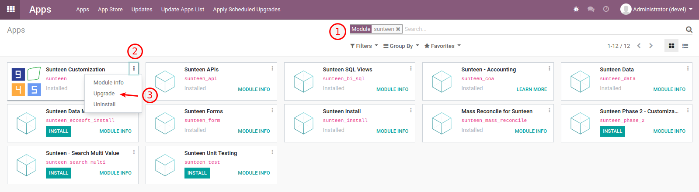
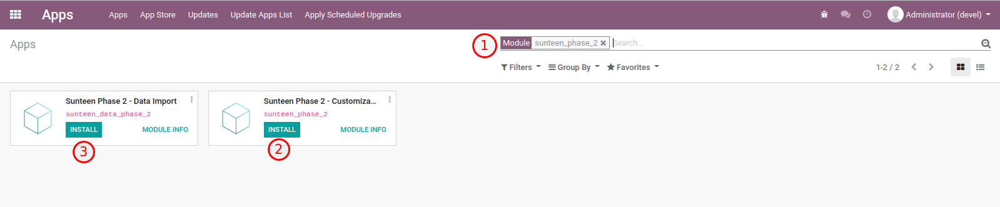

945 Phase 2
====================

945 Phase 2 Development Scope
---------------------------------------

* รองรับการเก็บสินค้าคงคลังมากกว่า 1 (Multi-Warehouse)
* รองรับการสร้างและ Validate เอกสารส่งออก (DO) อัตโนมัติ
* การบันทึกบัญชีเป็นแบบ Perpetual
* ระบบรองรับการผลิต (Manufacturing)
* มีการใช้ BoM ในการจัดชุด Kit และผลิตสินค้า

.. nextslide::

> Install 945 Phase 2
---------------------------------------

1. อัพเกรด module Sunteen เพื่อเพิ่ม Product Category ใหม่
โดยไปที่เมนู apps > search sunteen > Upgrade

2. Import Data ที่ส่งให้ทาง Email เข้าไปในระบบโดยภายในเอกสารจะมีข้อมูลดังนี้
    - ไฟล์ csv เรียงตามลำดับการ Import (3 ไฟล์)
        - 1.account.account.csv
        - 2.product.category.csv
        - 3.product.product.csv
    - ไฟล์ gif เรียงตามลำดับวิธีการ Import

3. ตั้งค่าระบบให้เป็น Multi Warehouses โดยไปที่เมนู
Inventory > Configuration > Settings > search คำว่า "multi" > เลือก Multi-Warehouses > Save

.. image:: images/install_2.png
    :align: center

4. Install Module sunteen_phase_2

5. เสร็จสิ้นกระบวนการติดตั้ง Phase 2

> Modules
================

OCA Modules
---------------------------------------

* account_move_line_<xxx>_info (purchase, sale and stock)
    เกี่ยวกับการเชื่อมเอกสารต้นทาง (SO, PO) ไปเอกสารปลายทาง (Invoicing)
    โดยแสดงที่หน้าต่าง Journal Items
* stock_account_prepare_anglo_saxon_out_lines_hook
    เกี่ยวกับการบันทึกเอกสารปลายทาง กรณีที่มีการบันทึกแบบ Perpetual.
* stock_inventory_valuation_unit_cost
    แสดง Column ราคาต่อหน่วยที่หน้า Inventory Valuation

.. nextslide::

945 Modules
---------------------------------------

* sunteen_phase_2
    โมดูลหลักสำหรับ Business Process ของ 945 ที่เพิ่มเติมใน Phase 2

.. nextslide::

> 945 APIs
==========

การใช้งาน APIs ระบบ 945 มีการเพิ่มเติมให้ส่ง warehouse_id เข้ามาในระบบ
หากไม่ใส่ระบบจะมีค่า Default เป็น "WH1"

ตัวอย่างการเพิ่ม warehouse_id

.. code-block:: python

    {
        "payload": {
            "status": "out of delivery",  # Status: out of delivery
            "partner_id": 1,  # Customer (res.partner)
            "sunteen_dealer_id": 2,  # Dealer (res.partner)
            "workflow_process_id": "eCommerce Standard",  # Automatic Workflow (sale.workflow.process)
            "date_order": "2020-01-31",  # Order Date
            "transaction_date": "",  # Transaction Date
            "sunteen_payment_method_id": 3,  # Payment Method (sunteen.payment.method)
            "sunteen_payment_provider_id": 34,  # Payment Provider (res.partner)
            "total": 500.0,  # Total
            "warehouse_id": "WH2", # Warehouse (stock.warehouse)
            "order_line": [  # Sale Order Line
                {
                    "sunteen_parcel_number": "TDZ001",  # Parcel Number
                    "sunteen_partner_id": 14,  # Transporter (res.partner)
                    "sunteen_customer": "CUSTOMER1",  # Customer
                    "product_id": 16,  # Product (product.product)
                    "product_uom_qty": 1,  # Quantity
                    "dealer_price_unit": 100.0,  # Dealer Unit Price
                },
                {
                    "sunteen_parcel_number": "TDZ001",
                    "sunteen_partner_id": 14,
                    "sunteen_customer": "CUSTOMER1",
                    "product_id": 17,
                    "product_uom_qty": 2,
                    "dealer_price_unit": 200.0,
                },
                {
                    "sunteen_parcel_number": "TDZ001",  # Dealer Amount Difference Line
                    "sunteen_partner_id": 14,
                    "sunteen_customer": "CUSTOMER1",
                    "product_id": 18,
                    "product_uom_qty": 1,
                    "dealer_price_unit": 20.0,  # API sent +, odoo change to -
                },
            ]
        },
        "auto_create": {    # Optional for auto create master data
            "partner_id": [
                {"name": "Customer 1", "ref": "CUSTOMER1"}
            ],
            "product_id": [
                {"name": "Product 1", "default_code": "PRODUCT1"}
            ]
        }
    }
